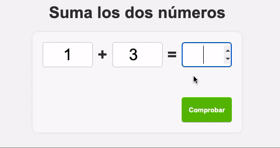

# ✨ **Try To Sum - Ejercicio**

## 📋 **Descripción del ejercicio**

En este ejercicio, se te proporcionará una interfaz de usuario (UI) ya creada en HTML y CSS para una aplicación que suma dos números. Tu tarea será implementar la lógica en **JavaScript** para que la aplicación funcione correctamente.

La aplicación debe:

- Generar dos números aleatorios entre 0 y 9.
- Permitir al usuario ingresar el resultado de la suma de esos dos números.
- Verificar si el resultado ingresado es correcto.
- Mostrar un mensaje de "Correcto" o "Incorrecto" basado en el resultado.
- Incluir un botón para reiniciar el ejercicio con nuevos números.

## ✅ **Requisitos**

1. **JavaScript**:

   - Implementar funciones para generar números aleatorios.
   - Crear funciones que realicen la verificación de la suma.
   - Mostrar mensajes dinámicos en la UI utilizando el DOM.

2. **Accesibilidad**:
   - Asegúrate de que al presionar la tecla "Enter", se verifique la respuesta del usuario sin tener que hacer clic en el botón.

## 🚀 **Instrucciones**

1. **Clona el repositorio** o descarga los archivos proporcionados. La UI ya está creada, solo necesitas agregar la lógica en el archivo `main.js`.

2. **Implementa las siguientes funciones en `main.js`**:

   - `add()`: Verifica si la suma ingresada es correcta.
   - `initNumbers()`: Genera dos números aleatorios para la suma.
   - `toogleButtons()`: Oculta y muestra los botones según la interacción del usuario.

3. **Pasos a seguir**:

   - Al cargar la página, dos números aleatorios deben aparecer en los campos correspondientes.
   - El usuario debe ingresar el resultado de la suma y presionar el botón "Comprobar" para verificar si es correcto.
   - Se debe mostrar un mensaje de "Correcto" o "Incorrecto" en la UI.
   - Si el resultado es incorrecto, se debe mostrar el mensaje con el resultado correcto.
   - El botón "Init" debe reiniciar la aplicación con nuevos números.
   - Puedes modificar cualquier parte del código.

4. **Archivos incluidos**:

   - `index.html`: Contiene la estructura de la UI.
   - `styles.css`: Contiene el estilo de la aplicación.
   - `main.js`: Aquí debes programar toda la lógica.

5. **Evaluación**:
   - La correcta implementación de la lógica de suma.
   - Uso adecuado del DOM para actualizar la UI.
   - Funcionalidad de reinicio y manejo del botón "Comprobar" y la tecla Enter.

## 🎯 **Vista previa de la aplicación**

